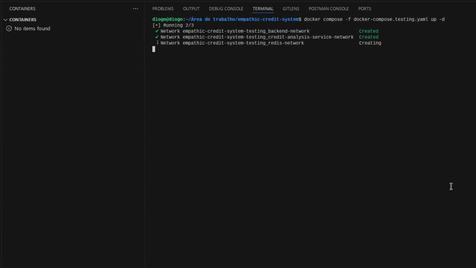

# Details

## Summary

- [Technologies](#technologies)
- [Key Concepts](#key-concepts)
- [Setup and Run](#setup-and-run)
- [System Architecture](#system-architecture)
- [Justification of Architectural Decisions](#justification-of-architectural-decisions)
- [Scalability and Fault Tolerance](#scalability-and-fault-tolerance)
- [SQL Query Examples](#sql-query-examples)
- [Asynchronous Processes, Streaming, and the Choice of NATS](#asynchronous-processes-streaming-and-the-choice-of-nats)
- [Endpoints](#endpoints)
- [Authentication Mechanism](#authentication-mechanism)
- [Logging STDOUT](#logging-stdout)
- [Configuration and Security](#configuration-and-security)
- [Data Privacy & Ethics](#data-privacy--ethics)
- [Trade-offs and Limitations](#trade-offs-and-limitations)

---

## Technologies

For an understanding of the technologies and why to use each of them, this section was created for later understandings of architectural decisions.

| Technology     | Why it's being used                                                                                                    | Main advantages of choice                                                                                                                                                                         |
|----------------|------------------------------------------------------------------------------------------------------------------------|---------------------------------------------------------------------------------------------------------------------------------------------------------------------------------------------------|
| NATS           | Real-time messaging system for communication between microservices and data streaming.                                 | Simplicity: Easy to set up and use. Performance: Very low latency for real-time events. Robustness: JetStream ensures that no critical messages are lost.                                         |
| Redis          | High-performance cache for implementing Cache-Aside Pattern, speeding up API responses.                                | Speed: Near-instantaneous memory data access. Market Standard: Ideal tool for Cache-Aside pattern. Flexibility: Supports multiple complex data structures.                                        |
| PostgreSQL     | Main relational database to store data of emotions, transactions, credits, etc.                                        | Reliability: ACID compliance ensures data integrity. Advanced Features: JSONB support and complex queries. Extensibility: Highly customizable for future needs.                                   |
| Grafana k6     | Load testing tool and simulation of sending emotional data from the mobile app to the system and sending transactions. | Easy to Use: Scripts in JavaScript, accessible to programmers. Visualization: Native integration with Grafana for analysis of results.                                                            |
| FastAPI        | Web framework to build the system REST API quickly and efficiently.                                                    | Performance: One of the fastest Python frameworks on the market. Productivity: Automatic generation of documentation and data validation. Modernity: Native support for asynchronous programming. |
| Docker         | Containerization platform to package services, ensuring consistency between development and production environments.   | Portability: "Works on my machine" turns "works anywhere". Insulation: Each service runs in its own safe environment. Ecosystem: Wide range of tools and ready-made images.                       |
| GitHub Actions | CI/CD platform to automate release generation and publication of Docker images.                                        | Integration: Native to GitHub, making setup easier. Flexibility: Allows the creation of complex and customized workflows. Automation: Ensures a standardized and reliable deployment process.     |

## Key Concepts

**Cache-Aside pattern:** A caching strategy where the application first attempts to retrieve data from the cache. If the data is not there (cache miss), the application retrieves the data from the primary source (database), stores it in the cache, and then returns it. In this project, this pattern is being implemented with Redis.

**Circuit Breaker:** A software design pattern used to detect failures and prevent a failure in one service from spreading to others, improving system resilience. In this project, it is being implemented using the `pybreak` library.

**Event-Driven:** An architectural approach where services communicate through events instead of direct synchronous calls. Producers publish events to a message broker, and consumers react to them asynchronously. In this project, NATS is used as the messaging system to ingest emotional data streams and trigger credit evaluation workflows.

**Microservice-Based:** A software architecture style where the system is built as a collection of small, independent services that communicate with each other. Each service is responsible for a specific business capability and can be developed, deployed, and scaled independently. In this project, services for emotion ingestion, credit evaluation, and offer management follow this principle.

---

## Setup and Run

### Production mode

To run the system in production, you need to execute the following command below:

```bash
docker-compose -f docker-compose.yaml up -d
```

If the above command returns an error, try removing the hyphen between the words `docker` and `compose`.

You will be unable to access the database, cache, and messaging system as they have internal networks. The only system you can access directly is the API Gateway load balancer.


### Test mode

To run the system in production, you need to execute the following command below:

```bash
docker-compose -f docker-compose.testing.yaml up -d
```

If the above command returns an error, try removing the hyphen between the words `docker` and `compose`.

In this mode, it is possible to access the database directly, since some SQL queries will be made directly in the database during the execution of integration tests for the entire flow.


### Running tests

First, you need to ensure that the test environment services have been started correctly (follow the steps in the section above).

To avoid having to register and log in manually, two k6 load tests are available to register and log in multiple users at the same time.

```bash
chmod +x generate_sessions.sh && ./generate_sessions.sh
```

If you want to do the process manually, inside the k6 directory, after executing the above command, .json files with the necessary information will be available.

After that, using the command line, access the folder named `tests` and execute the following commands in order.

```bash
cd tests/ && python3 -m venv .venv && source .venv/bin/activate && pip install -r requirements.txt
```

This command will enter the folder, create the development environment, access the virtual environment and install the necessary dependencies.

After completing the above step, run the tests with the following command:

```bash
pytest
```

To exit the virtual environment, run the command below:

```bash
deactivate
```



**_During the execution of the tests, some tests may fail, which is expected behavior because during the ingestion of emotions and transactions, the system verifies whether the data has been consumed and persisted in the database. And since the test is running locally, the processing time may vary, meaning that all tests may pass or some may fail._**

**_Currently, the test code is configured to wait 500 ms before checking the database._**


Below you can see the complete test execution flow.


### Grafana k6

Grafana k6 is being used for two purposes: to simulate the sending of emotions via the mobile app and to simulate the sending of transactions by the user. To install Grafana k6, refer to the [official Grafana documentation](https://grafana.com/docs/k6/latest/set-up/install-k6/).

To run the load test, navigate to the `k6/emotion-ingestion-service` and `k6/transaction-service` folders.

In each folder that meets the above specifications, run the command below:

```bash
k6 run test.js
```

The above command will execute the `test.js` file containing test implementation details.


To remove the containers along with their volumes and networks from your local machine, run the following commands below:

```bash
docker-compose -f docker-compose.yaml down -v
docker-compose -f docker-compose.testing.yaml down -v
```

If the above command returns an error, try removing the hyphen between the words `docker` and `compose`.

---

## System Architecture

The Empathic Credit System (ECS) architecture is robust and modern, based on two main pillars: microservices and event orientation. This choice directly meets the requirements for scalability and fault tolerance.

### Justification of Architectural Decisions

**Microservices:** The system is divided into smaller, independent services, each with a unique responsibility. This is visible in docker-compose.yaml, which orchestrates containers for:

- `api-gateway-ecs`: Single entry point that routes requests.

- `emotion-ingestion-service` & `transaction-service`: Data ingestion services that receive requests and publish events.

- `emotion-processing-worker` & `transaction-processing-worker`: Workers that consume events and persist data in the database.

- `credit-analysis-service`: A mock service that simulates ML analysis.

- `user-and-credit-service`: Manages users, offers, and orchestrates credit analysis.

- `credit-application-worker`: Processes the acceptance of credit offers asynchronously and notifies the user.

This separation allows each service to be developed, deployed, and scaled independently. For example, if emotion ingestion becomes a bottleneck, we can increase the number of replicas of the `emotion-ingestion-service` without affecting other services, as defined by the deploy: replicas: 2 directive in `docker-compose.yaml`.

**Event Orientation with NATS:** Communication between ingestion services and processing workers is asynchronous, using NATS as a message broker.


The diagram above illustrates this perfectly: the Emotion Ingestion Service receives the request, publishes an event in the user.emotions.topic topic, and immediately returns a 202 Accepted response. The Emotion Processing Worker consumes this message independently to process it and persist it in the PostgreSQL database.

The same pattern occurs in the diagram below, decoupling the writing of the request from the processing itself.


### Credit Analysis


This diagram shows the synchronous flow of a credit analysis request initiated by the user.

**User Request:** The user requests a credit analysis through the endpoint `/v1/users/{user_id}/credit-analysis`.

**Routing:** The request passes through the Load Balancer and API Gateway, which forwards it to the User and Credit Service.

**Analysis Orchestration:** The User and Credit Service orchestrates the process:

- **Cache Lookup:** It first checks Redis (indicated by the dotted arrow) to see if there is already a recent analysis result for that user, in order to avoid reprocessing. An invalidation time has been set to simulate real scenarios in which users cannot perform consecutive checks.

- **Call to ML Service:** It gathers the necessary user data (from the database) and makes an HTTP call to the `/v1/predict` endpoint of the Credit Analysis Service.

- **Calculation and Persistence:** With the risk score returned by the ML service, it decides whether or not to approve the credit. If approved, it calculates the limit/interest, saves the new offer in the credit_limits table, and stores the result in the Redis cache.

**Response to the User:** Finally, it returns the complete response (approved/denied and the details of the offer, if any) directly to the user in the same HTTP call.

This architecture was chosen to provide immediate feedback to the user while maintaining the modularity and performance of the system.

**Immediate Feedback:** Unlike data ingestion, a credit analysis is an action that the user performs and expects an immediate result (“Was I approved?”). Therefore, a synchronous flow is the right choice for this user experience.

**Modularity (Microservices):** The logic of the Machine Learning model is isolated in its own service (Credit Analysis Service). This allows the data science team to update, train, and deploy new versions of the model independently, without impacting the rest of the system. The User and Credit Service only consumes its API.

**Performance with Cache:** Credit analyses can be costly (involving multiple database queries and ML processing). The use of Redis as a cache layer (Cache-Aside pattern) is a crucial optimization. If the user requests a new analysis immediately afterwards, the system can return the cached result instantly, dramatically improving performance and reducing the load on services and the database.

### Accept credit limit offer


The process, as illustrated in the diagram, works in two main stages: one synchronous (fast) and one asynchronous (in the background).

**User Request:**

- The user initiates the process by sending a request to accept a specific credit offer via the endpoint `/v1/credit-offers/{offer_id}/accept`.
- The request passes through the Load Balancer and API Gateway, which directs it to the User and Credit Service.
- This service performs a single critical and fast task: validating the offer. It queries the database (credit_limits) to ensure that the offer exists, belongs to the user, has not expired, and is still in the “offered” state.

**Event Publication:**

- If the validation is successful, the User and Credit Service does not activate the credit. Instead, it publishes an event (a message) to the `credit.offers.approved` topic in NATS.
- Immediately after publishing the event, the service returns a success response to the user (such as an HTTP 202 Accepted), informing them that the request has been received and is being processed.

**Background Processing:**

- Another service, the Credit Application Worker (shown in the diagram credit application worker.png), is constantly “listening” to the `credit.offers.approved` topic.
- Upon receiving the message, this worker executes the complete business logic: it updates the offer status in the database to “active” and publishes another event to notify the user.

This approach was chosen because it is a robust design pattern that prioritizes performance, resilience, and scalability.

**Better User Experience:** The user receives an almost instant response. The only operation they need to wait for is a simple validation in the database. Slower operations, such as multiple writes to the database or sending notifications, are performed in the background, making the application appear extremely fast and responsive.

**Greater Resilience and Fault Tolerance:** By decoupling the initial request from the complete processing, the system becomes more robust. If, for example, the database is slow or the notification service is temporarily unavailable, the user's request does not fail. The “accept” event has already been published and is secure in NATS. The worker can reprocess the message later, when the dependent systems return to normal, ensuring that no offer acceptance is lost.

**Independent Scalability:** Components can be scaled independently. The User and Credit Service, which handles user traffic, needs to be fast, but the logic is simple. The Credit Application Worker, on the other hand, can experience work spikes (many users accepting offers at the same time). With this architecture, you can increase only the number of worker replicas to process the event queue faster, without having to scale the service that interacts directly with the user, optimizing resource usage.

### Processing accepted offers


This diagram illustrates the asynchronous processing that occurs after a user accepts a credit offer.

**Trigger (Start of Flow):** The process begins when an event, published by another service, arrives at the NATS topic `credit.offers.approved`.

**Event Consumption:** The Credit Application Worker, a dedicated background service, is subscribed to this topic. It consumes the message as soon as it becomes available.

**Business Logic Execution:** Upon receiving the event, the worker performs the tasks necessary to finalize the credit activation:

- **Updates the Database:** It connects to the database and changes the status of the offer in the credit_limits table to “active.”

- **Triggers the Notification:** It then publishes a new event in the NATS user.notifications topic, signaling that the user should be notified about the activation.

This approach, which isolates business logic in a worker, was chosen to ensure reliability, decoupling, and scalability.

**Reliability:** Activating a credit is a critical operation that cannot be lost. By using a worker that consumes from a message queue (NATS), you ensure that even if the worker fails or the database is unavailable, the message will remain in the queue to be reprocessed. This ensures that the operation will eventually be executed.

**Decoupling:** The service that handles the initial user request (User and Credit Service) does not need to know the details of how a credit is activated or how notifications are sent. It just “announces” that an offer has been accepted. This separation of responsibilities makes the system more modular and easier to maintain.

**Scalability:** The work of activating credits can vary in volume. If many users accept offers at the same time, you can simply increase the number of Credit Application Worker instances. They will consume the messages from the topic in parallel, processing the workload efficiently without overloading other components of the system.

### Scalability and Fault Tolerance

**Horizontal Scalability:** The `docker-compose.yaml` already provides multiple replicas for services that handle external traffic, such as `api-gateway-ecs`, `emotion-ingestion-service`, and `user-and-credit-service`. This distributes the load and allows the system to support a larger number of requests. Nginx (`api-gateway-ecs-nginx`) acts as a load balancer, distributing traffic among the gateway replicas.

**Fault Tolerance:**

- **_Circuit Breaker:_** One of the most important optional features has been implemented. The `user-and-credit-service` uses the pybreaker library to wrap the call to the credit-analysis-service. If the ML service becomes slow or unavailable, the circuit breaker opens after 5 failures, preventing new calls for 30 seconds and returning an immediate error (503 Service Unavailable), preventing cascading failures from bringing down the system.

- **_Queues and Retries:_** The use of NATS ensures that if a processing worker fails, the message will not be lost. It will remain in the queue to be reprocessed by another instance of the worker or by the same worker when it recovers. The message processing code includes error handling and the use of `msg.nak(delay=10)` to requeue the message in case of failure.

- **_Cache-Aside Pattern:_** The `user-and-credit-service` implements the Cache-Aside pattern with Redis for user data and ML results. This not only improves performance but also reduces the load on the database. If Redis becomes unavailable, the code is prepared to fetch the data directly from PostgreSQL, ensuring continuity of operation.

---

## SQL Query Examples

The project makes use of efficient SQL queries to interact with the PostgreSQL database. The schema is well-defined in `sql/init.sql`, with indexes used for optimization.

## Example 1: Fetching Aggregated Data for the ML Feature Vector

- **Objective**: To collect transactional and emotional data from a user to feed the credit analysis model.
- **Location**: `services/user-and-credit-service/database/database.py` in the `get_user_features` function.
- **Query**:

    ```sql
    SELECT AVG(avg_positivity_score) as avg_positivity, SUM(event_count) as stress_events
    FROM emotional_events_summary
    WHERE user_id = $1 AND summary_date >= NOW() - INTERVAL '7 days';
    ```

- **Explanation**: This query calculates the average positivity (`AVG`) and the total number of stress events (`SUM`) for a given user (`user_id`) in the last 7 days. It queries the `emotional_events_summary` table, which already contains pre-aggregated daily data, making the query very fast.

## Example 2: Inserting or Updating the Emotional Events Summary (UPSERT)

- **Objective**: To maintain an aggregated daily record of the user's emotions, updating the average with each new event.
- **Location**: `services/emotion-processing-worker/database/database.py` in the `update_emotional_summary` function.
- **Query**:

    ```sql
    INSERT INTO emotional_events_summary (user_id, summary_date, avg_positivity_score, ...)
    VALUES ($1, $2, $3, ...)
    ON CONFLICT (user_id, summary_date)
    DO UPDATE SET
        avg_positivity_score = (emotional_events_summary.avg_positivity_score * emotional_events_summary.event_count + EXCLUDED.avg_positivity_score) / (emotional_events_summary.event_count + 1),
        ...
        event_count = emotional_events_summary.event_count + 1,
        updated_at = NOW();
    ```

- **Explanation**: This is an UPSERT (`UPDATE` or `INSERT`) query. It attempts to insert a new record. If a record for the same `user_id` and `summary_date` already exists (a conflict detected by the `UNIQUE` constraint), it executes the `DO UPDATE` clause. This clause recalculates the average scores for positivity, intensity, and stress, and increments the event counter. It's an extremely efficient way to maintain aggregated data without requiring multiple calls to the database.

---

## Asynchronous Processes, Streaming, and the Choice of NATS

Event-driven architecture is central to the system’s performance and resilience, and the choice of **NATS** was strategic.

## Asynchronous Processes

As required in the technical case, data processing and credit activation operations are **asynchronous**.

### Data Ingestion

When an emotion or transaction event arrives, the corresponding API service **publishes the message to NATS** and immediately returns a `202 Accepted` response.  
This provides an extremely fast user experience, as the user does not need to wait for full processing.  
The heavy work is performed in the background by workers:

- `emotion-processing-worker`
- `transaction-processing-worker`

### Credit Activation

Similarly, when a user accepts an offer, the **user-and-credit-service** publishes an event to the topic `credit.offers.approved`, and the **credit-application-worker** processes the activation:

- Updates the database  
- Sends a notification (also via NATS)

### Data Streaming

The system is designed to handle a **continuous flow of emotion events**, characterizing a **real-time data streaming** use case.

### Why NATS?

The choice of **NATS**, as justified in `technologies.md`, is ideal for this scenario for several reasons:

#### High Performance and Low Latency

NATS is known for being extremely fast and lightweight, designed for high-performance systems where **latency is critical**.  
For processing emotional data in real time, this characteristic is essential.

#### Simplicity

Configuring and using NATS is simpler compared to alternatives like **Kafka**, which speeds up development without sacrificing robustness for this use case.

#### Robustness with JetStream

The project uses **NATS JetStream**, which adds features such as:

- Persistence (`storage file`)  
- Guaranteed delivery  
- Message re-delivery  

This ensures that **no critical event is lost**, even if workers are temporarily offline.

---

## Endpoints

The `api-gateway-ecs` centralizes access to the system, routing requests to the appropriate internal microservices. Below are the endpoints and examples of how to use them.

### Authentication

#### Register a new user

- **Endpoint**: `POST /v1/auth/register`

- **Description**: Creates a new user in the system.

- **Example `cURL`**:

    ```bash
    curl -X POST http://localhost:9999/v1/auth/register \
    -H "Content-Type: application/json" \
    -d '{
        "email": "new_user@example.com",
        "password": "super_secure_password_123"
    }'
    ```

#### User login

- **Endpoint**: `POST /v1/auth/login`

- **Description**: Authenticates a user and returns a JWT token.

- **Example `cURL`**:

    ```bash
    curl -X POST http://localhost:9999/v1/auth/login \
    -H "Content-Type: application/json" \
    -d '{
        "email": "new_user@example.com",
        "password": "super_secure_password_123"
    }'
    ```

### Data Ingestion endpoints

#### Send emotion event (Internal communication)

- **Endpoint**: `POST /v1/emotions/stream`

- **Description**: Receives and publishes an emotion event. Protected by an internal API key (`X-Internal-Key`).

- **Example `cURL`**:

    ```bash
    curl -X POST http://localhost:9999/v1/emotions/stream \
    -H "Content-Type: application/json" \
    -H "X-Internal-Key: your-different-secret-for-internal-services" \
    -d '{
        "userId": "user-uuid-here",
        "timestamp": "2025-08-19T12:00:00Z",
        "emotionEvent": {
            "type": "SENTIMENT_ANALYSIS",
            "metrics": {
                "positivity": 0.85,
                "intensity": 0.7,
                "stress_level": 0.15
            }
        }
    }'
    ```

#### Send transaction event

- **Endpoint**: `POST /v1/transactions`

- **Description**: Receives and publishes a transaction event. Requires JWT token authentication.

- **Example `cURL`**:

    ```bash
    curl -X POST http://localhost:9999/v1/transactions \
    -H "Content-Type: application/json" \
    -H "Authorization: Bearer your-jwt-token-here" \
    -d '{
        "userId": "user-uuid-here",
        "amount": 199.99
    }'
    ```

### Credit Analysis and Offers

#### Request credit analysis

- **Endpoint**: `POST /v1/users/{user_id}/credit-analysis`

- **Description**: Initiates the credit analysis flow for a user. Requires JWT token.

- **Example `cURL`**:

    ```bash
    curl -X POST http://localhost:9999/v1/users/user-uuid-here/credit-analysis \
    -H "Authorization: Bearer your-jwt-token-here"
    ```

#### Accept a credit offer

- **Endpoint**: `POST /v1/credit-offers/{offer_id}/accept`

- **Description**: Marks a credit offer as accepted and starts the asynchronous activation process. Requires JWT token.

- **Example `cURL`**:

    ```bash
    curl -X POST http://localhost:9999/v1/credit-offers/offer-uuid-here/accept \
    -H "Content-Type: application/json" \
    -H "Authorization: Bearer your-jwt-token-here" \
    -d '{
        "userId": "user-uuid-here"
    }'
    ```

#### List a user's credit offers

- **Endpoint**: `GET /v1/users/{user_id}/offers`

- **Description**: Returns a paginated list of a user's credit offers. Requires JWT token.

- **Example `cURL**:

    ```bash
    curl -X GET "http://localhost:9999/v1/users/user-uuid-here/offers?page=1&page_size=10" \
    -H "Authorization: Bearer your-jwt-token-here"
    ```

---

## Authentication Mechanism

The system uses a double authentication scheme, ensuring security for both external clients (users) and internal communication between services.

**External Authentication (JWT Bearer Token):**

- **Implementation:** For endpoints accessed by users, such as `/v1/transactions` or `/v1/users/{user_id}/credit-analysis`, the system requires a JSON Web Token (JWT) in the Authorization header.

- **Flow:** The user authenticates via `/v1/auth/login`. The user-and-credit-service validates the credentials and, if correct, generates a JWT token signed with SECRET_KEY using the HS256 algorithm. This token, containing the user ID and expiration date, is returned. In each subsequent request, the API Gateway uses the validate_api_key function to decode and validate the token before forwarding the call.

**Internal Authentication (API Key):**

- **Implementation:** For communication between services that should not be publicly exposed, such as emotion ingestion, a static API key is used.

- **Flow:** The source service (e.g., a simulator) must include the key in the X-Internal-Key header. The API Gateway uses the validate_internal_api_key function to verify that the received key matches the INTERNAL_SERVICE_API_KEY defined in the environment variables. This ensures that only trusted services can send emotion data to the system.

---

## Logging STDOUT

The logging implementation follows best practices for containerized environments, writing structured logs to standard output (STDOUT), as requested.

**Implementation**: In each service, inside the `configuration/config.py` file, Python’s `logging` library is configured with `logging.basicConfig`.

**Code example**:

```python
import logging
logging.basicConfig(level=logging.INFO, format="%(asctime)s - %(levelname)s - %(message)s")
logger = logging.getLogger("emotion_processing_worker")
```

- **Explanation**: `logging.basicConfig` without a `filename` directs all log outputs to the standard stream, which in a Docker container means STDOUT.  
  
The defined format (`format="..."`) ensures that each log line is structured with a timestamp, severity level, and message, making it easier to aggregate and analyze with external tools such as Fluentd, Logstash, or cloud services (CloudWatch, etc.).

---

## Configuration and Security

The project strictly adheres to configuration and security requirements.

**Use of Environment Variables**: No sensitive information, such as database URLs, secret keys, or credentials, is hardcoded in the code. All configurations are loaded from environment variables using `os.getenv()`.

**Example**: The file `services/user-and-credit-service/configuration/config.py` loads `DATABASE_URL`, `NATS_URL`, `REDIS_URL`, and `SECRET_KEY` from the environment.

**Secure Practice**: The repositories include `.env.example` files with the structure of the required variables, but without actual values. This allows secret values to be securely injected into production environments through orchestrators such as Kubernetes Secrets or Docker Compose environment variables.

**Authentication Mechanism**: As detailed in point 3, the choice of JWT for external users and an API key for internal services is a robust approach that clearly separates the two security domains.

---

## Data Privacy & Ethics

The technical case is fictional, but it raises important ethical questions regarding the use of emotional data.  
While the current code does not implement these protections, a robust strategy for a real system would be:

**Private Networks**: All services run in **private networks**, isolated from external access.  
The **only exposed network is the API Gateway**, which acts as the single entry point to the system.

**Encryption**:

- **In Transit**: All communications between the client and the API Gateway, as well as between microservices, must be protected with TLS (HTTPS). Nginx can be configured to enforce TLS at the edge. Communication with NATS and PostgreSQL should also be configured to use TLS.  
- **At Rest**: Sensitive data in the PostgreSQL database must be encrypted. PostgreSQL supports column-level encryption (using the `pgcrypto` extension, already included in `init.sql`) or full-disk encryption at the filesystem level.

**Anonymization and Pseudonymization (LGPD/GDPR):**

- **Pseudonymization**: The `user_id` (a UUID) is already a form of pseudonym. However, for aggregated data analysis where individual identity is unnecessary, we can go further.  
- **Anonymization**: Before storing emotional data for long-term trend analysis, we could completely dissociate it from the `user_id`. For example, creating a copy of the data in a data lake, removing the `user_id` and keeping only non-identifiable attributes (such as age group, region, etc.) to train models or extract insights without compromising individual privacy.

**LGPD/GDPR Compliance:**

- **Consent**: Users must provide explicit, clear, and informed consent for the collection and use of their emotional data for credit analysis purposes.  
- **Right of Access and Deletion**: The system must provide mechanisms for users to view the data collected about them and request its deletion, as guaranteed by LGPD/GDPR.

---

## Trade-offs and Limitations

Every architecture involves choices and compromises.

**Single Database vs. Database per Service**: Currently, multiple services share the same PostgreSQL database. While this simplifies development and data management, in a pure microservices architecture this is considered an anti-pattern, as it creates strong coupling between services.  
The ideal (but more complex) approach would be for each service to have its own database, communicating through events to maintain consistency.

**NATS vs. Kafka**: NATS was chosen for its simplicity and performance. However, for use cases that require event retention over long periods (for auditing or full historical reprocessing), Apache Kafka could be a more robust alternative, though more complex to operate.

**Integration Tests**: The documentation (`setup-and-execution.md`) mentions that tests may fail due to variations in local processing time. This highlights a certain fragility in the tests, which could be improved by using smarter probing mechanisms (e.g., polling with timeout) instead of relying on a fixed `asyncio.sleep(0.5)`.

**Secrets in Docker Compose**: The `docker-compose.yaml` file defines secret keys directly in the `environment` block. In a real production environment, it would be safer to use **Docker Secrets** or inject variables from a **secrets vault** (such as HashiCorp Vault or AWS Secrets Manager).

---

Return to [README.md](../../../README.md).
