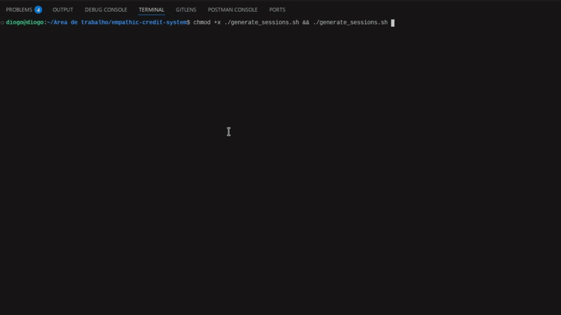
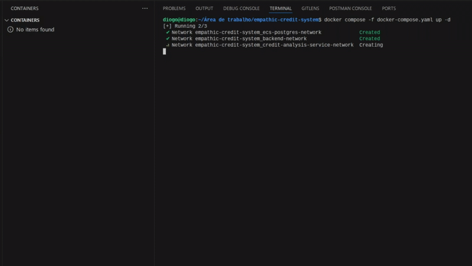

# Setup and Run

## Production mode

To run the system in production, you need to execute the following command below:

```bash
docker-compose -f docker-compose.yaml up -d
```

If the above command returns an error, try removing the hyphen between the words `docker` and `compose`.

You will be unable to access the database, cache, and messaging system as they have internal networks. The only system you can access directly is the API Gateway load balancer.


## Test mode

To run the system in production, you need to execute the following command below:

```bash
docker-compose -f docker-compose.testing.yaml up -d
```

If the above command returns an error, try removing the hyphen between the words `docker` and `compose`.

In this mode, it is possible to access the database directly, since some SQL queries will be made directly in the database during the execution of integration tests for the entire flow.


## Running tests

First, you need to ensure that the test environment services have been started correctly (follow the steps in the section above).

To avoid having to register and log in manually, two k6 load tests are available to register and log in multiple users at the same time.

```bash
chmod +x generate_sessions.sh && ./generate_sessions.sh
```

If you want to do the process manually, inside the k6 directory, after executing the above command, .json files with the necessary information will be available.

After that, using the command line, access the folder named `tests` and execute the following commands in order.

```bash
cd tests/ && python3 -m venv .venv && source .venv/bin/activate && pip install -r requirements.txt
```

This command will enter the folder, create the development environment, access the virtual environment and install the necessary dependencies.

After completing the above step, run the tests with the following command:

```bash
pytest
```

To exit the virtual environment, run the command below:

```bash
deactivate
```


**_During the execution of the tests, some tests may fail, which is expected behavior because during the ingestion of emotions and transactions, the system verifies whether the data has been consumed and persisted in the database. And since the test is running locally, the processing time may vary, meaning that all tests may pass or some may fail._**

**_Currently, the test code is configured to wait 500 ms before checking the database._**


Below you can see the complete test execution flow.



## Grafana k6

Grafana k6 is being used for two purposes: to simulate the sending of emotions via the mobile app and to simulate the sending of transactions by the user. To install Grafana k6, refer to the [official Grafana documentation](https://grafana.com/docs/k6/latest/set-up/install-k6/).

To run the load test, navigate to the `k6/emotion-ingestion-service` and `k6/transaction-service` folders.

In each folder that meets the above specifications, run the command below:

```bash
k6 run test.js
```

The above command will execute the `test.js` file containing test implementation details.



To remove the containers along with their volumes and networks from your local machine, run the following commands below:

```bash
docker-compose -f docker-compose.yaml down -v
docker-compose -f docker-compose.testing.yaml down -v
```

If the above command returns an error, try removing the hyphen between the words `docker` and `compose`.
