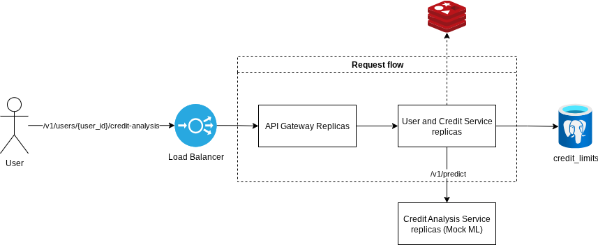

# System Architecture

The Empathic Credit System (ECS) architecture is robust and modern, based on two main pillars: microservices and event orientation. This choice directly meets the requirements for scalability and fault tolerance.

## Justification of Architectural Decisions

**Microservices:** The system is divided into smaller, independent services, each with a unique responsibility. This is visible in docker-compose.yaml, which orchestrates containers for:

- `api-gateway-ecs`: Single entry point that routes requests.

- `emotion-ingestion-service` & `transaction-service`: Data ingestion services that receive requests and publish events.

- `emotion-processing-worker` & `transaction-processing-worker`: Workers that consume events and persist data in the database.

- `credit-analysis-service`: A mock service that simulates ML analysis.

- `user-and-credit-service`: Manages users, offers, and orchestrates credit analysis.

- `credit-application-worker`: Processes the acceptance of credit offers asynchronously and notifies the user.

This separation allows each service to be developed, deployed, and scaled independently. For example, if emotion ingestion becomes a bottleneck, we can increase the number of replicas of the `emotion-ingestion-service` without affecting other services, as defined by the deploy: replicas: 2 directive in `docker-compose.yaml`.

**Event Orientation with NATS:** Communication between ingestion services and processing workers is asynchronous, using NATS as a message broker.

The diagram above illustrates this perfectly: the Emotion Ingestion Service receives the request, publishes an event in the user.emotions.topic topic, and immediately returns a 202 Accepted response. The Emotion Processing Worker consumes this message independently to process it and persist it in the PostgreSQL database.

The same pattern occurs in the diagram below, decoupling the writing of the request from the processing itself.

## Credit Analysis

This diagram shows the synchronous flow of a credit analysis request initiated by the user.

**User Request:** The user requests a credit analysis through the endpoint `/v1/users/{user_id}/credit-analysis`.

**Routing:** The request passes through the Load Balancer and API Gateway, which forwards it to the User and Credit Service.

**Analysis Orchestration:** The User and Credit Service orchestrates the process:

- **Cache Lookup:** It first checks Redis (indicated by the dotted arrow) to see if there is already a recent analysis result for that user, in order to avoid reprocessing. An invalidation time has been set to simulate real scenarios in which users cannot perform consecutive checks.

- **Call to ML Service:** It gathers the necessary user data (from the database) and makes an HTTP call to the `/v1/predict` endpoint of the Credit Analysis Service.

- **Calculation and Persistence:** With the risk score returned by the ML service, it decides whether or not to approve the credit. If approved, it calculates the limit/interest, saves the new offer in the credit_limits table, and stores the result in the Redis cache.

**Response to the User:** Finally, it returns the complete response (approved/denied and the details of the offer, if any) directly to the user in the same HTTP call.

This architecture was chosen to provide immediate feedback to the user while maintaining the modularity and performance of the system.

**Immediate Feedback:** Unlike data ingestion, a credit analysis is an action that the user performs and expects an immediate result (“Was I approved?”). Therefore, a synchronous flow is the right choice for this user experience.

**Modularity (Microservices):** The logic of the Machine Learning model is isolated in its own service (Credit Analysis Service). This allows the data science team to update, train, and deploy new versions of the model independently, without impacting the rest of the system. The User and Credit Service only consumes its API.

**Performance with Cache:** Credit analyses can be costly (involving multiple database queries and ML processing). The use of Redis as a cache layer (Cache-Aside pattern) is a crucial optimization. If the user requests a new analysis immediately afterwards, the system can return the cached result instantly, dramatically improving performance and reducing the load on services and the database.

## Accept credit limit offer

The process, as illustrated in the diagram, works in two main stages: one synchronous (fast) and one asynchronous (in the background).

**User Request:**

- The user initiates the process by sending a request to accept a specific credit offer via the endpoint `/v1/credit-offers/{offer_id}/accept`.
- The request passes through the Load Balancer and API Gateway, which directs it to the User and Credit Service.
- This service performs a single critical and fast task: validating the offer. It queries the database (credit_limits) to ensure that the offer exists, belongs to the user, has not expired, and is still in the “offered” state.

**Event Publication:**

- If the validation is successful, the User and Credit Service does not activate the credit. Instead, it publishes an event (a message) to the `credit.offers.approved` topic in NATS.
- Immediately after publishing the event, the service returns a success response to the user (such as an HTTP 202 Accepted), informing them that the request has been received and is being processed.

**Background Processing:**

- Another service, the Credit Application Worker (shown in the diagram credit application worker.png), is constantly “listening” to the `credit.offers.approved` topic.
- Upon receiving the message, this worker executes the complete business logic: it updates the offer status in the database to “active” and publishes another event to notify the user.

This approach was chosen because it is a robust design pattern that prioritizes performance, resilience, and scalability.

**Better User Experience:** The user receives an almost instant response. The only operation they need to wait for is a simple validation in the database. Slower operations, such as multiple writes to the database or sending notifications, are performed in the background, making the application appear extremely fast and responsive.

**Greater Resilience and Fault Tolerance:** By decoupling the initial request from the complete processing, the system becomes more robust. If, for example, the database is slow or the notification service is temporarily unavailable, the user's request does not fail. The “accept” event has already been published and is secure in NATS. The worker can reprocess the message later, when the dependent systems return to normal, ensuring that no offer acceptance is lost.

**Independent Scalability:** Components can be scaled independently. The User and Credit Service, which handles user traffic, needs to be fast, but the logic is simple. The Credit Application Worker, on the other hand, can experience work spikes (many users accepting offers at the same time). With this architecture, you can increase only the number of worker replicas to process the event queue faster, without having to scale the service that interacts directly with the user, optimizing resource usage.

## Processing accepted offers

This diagram illustrates the asynchronous processing that occurs after a user accepts a credit offer.

**Trigger (Start of Flow):** The process begins when an event, published by another service, arrives at the NATS topic `credit.offers.approved`.

**Event Consumption:** The Credit Application Worker, a dedicated background service, is subscribed to this topic. It consumes the message as soon as it becomes available.

**Business Logic Execution:** Upon receiving the event, the worker performs the tasks necessary to finalize the credit activation:

- **Updates the Database:** It connects to the database and changes the status of the offer in the credit_limits table to “active.”

- **Triggers the Notification:** It then publishes a new event in the NATS user.notifications topic, signaling that the user should be notified about the activation.

This approach, which isolates business logic in a worker, was chosen to ensure reliability, decoupling, and scalability.

**Reliability:** Activating a credit is a critical operation that cannot be lost. By using a worker that consumes from a message queue (NATS), you ensure that even if the worker fails or the database is unavailable, the message will remain in the queue to be reprocessed. This ensures that the operation will eventually be executed.

**Decoupling:** The service that handles the initial user request (User and Credit Service) does not need to know the details of how a credit is activated or how notifications are sent. It just “announces” that an offer has been accepted. This separation of responsibilities makes the system more modular and easier to maintain.

**Scalability:** The work of activating credits can vary in volume. If many users accept offers at the same time, you can simply increase the number of Credit Application Worker instances. They will consume the messages from the topic in parallel, processing the workload efficiently without overloading other components of the system.

## Scalability and Fault Tolerance

**Horizontal Scalability:** The `docker-compose.yaml` already provides multiple replicas for services that handle external traffic, such as `api-gateway-ecs`, `emotion-ingestion-service`, and `user-and-credit-service`. This distributes the load and allows the system to support a larger number of requests. Nginx (`api-gateway-ecs-nginx`) acts as a load balancer, distributing traffic among the gateway replicas.

**Fault Tolerance:**

- **_Circuit Breaker:_** One of the most important optional features has been implemented. The `user-and-credit-service` uses the pybreaker library to wrap the call to the credit-analysis-service. If the ML service becomes slow or unavailable, the circuit breaker opens after 5 failures, preventing new calls for 30 seconds and returning an immediate error (503 Service Unavailable), preventing cascading failures from bringing down the system.

- **_Queues and Retries:_** The use of NATS ensures that if a processing worker fails, the message will not be lost. It will remain in the queue to be reprocessed by another instance of the worker or by the same worker when it recovers. The message processing code includes error handling and the use of `msg.nak(delay=10)` to requeue the message in case of failure.

- **_Cache-Aside Pattern:_** The `user-and-credit-service` implements the Cache-Aside pattern with Redis for user data and ML results. This not only improves performance but also reduces the load on the database. If Redis becomes unavailable, the code is prepared to fetch the data directly from PostgreSQL, ensuring continuity of operation.
